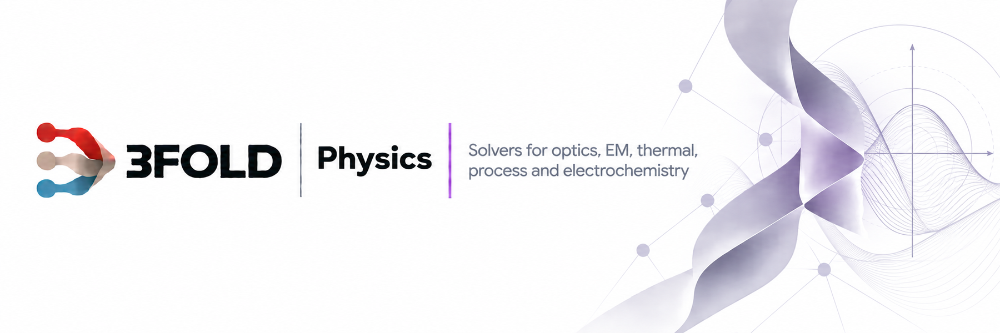

<picture>
  <source media="(prefers-color-scheme: dark)" srcset="docs/brand/banner-dark.png">
  
</picture>

> Part of 3FOLD · results are nodes in the [Decorrelation Graph Engine](https://github.com/antonbj3/3fold-graph-engine)

---

## What it is

A library of single-file physics solvers, grouped by domain: most in numpy and scipy, twenty-two on the GPU in Warp or torch: the partially coherent imaging engine, the batched lens tracer and its design search, wave inverse design and calibration, and sixteen GPU siblings of CPU modules. Each file is a script: it computes a result from first principles and checks it against a closed-form law, a published constant, a public measurement or a null case, printing PASS or FAIL per gate and exiting non-zero on FAIL. The solvers were written one at a time as the project needed them, so coverage follows the project's questions, not a textbook's table of contents. This is an early-stage collection: nearly all of the modules reproduce their numbers in this repository, and the ones that fail their own gate on real data are listed as failing, with the gate quoted.

---

## What is in it

**Electromagnetism** (`em/`, 21 modules). Magnetostatics: Biot–Savart Helmholtz pair, eddy-current brake, magnetron Hull cutoff. Mean-field magnetism: Curie–Weiss, two-level paramagnet. Lattice MHD: Alfvén waves, magnetoconvection, two-stream instability with its growth rate checked against the cold-dispersion quartic. EM–elastic coupling: Maxwell stress, magnetostriction, piezoelectric rod resonator, Rosensweig instability.

**Scattering** (`scattering/`, 10). Exact 2-D and 3-D Mie solutions for dielectric cylinders and spheres, a physical-optics radar-cross-section model, a 2-D multiple-scattering Helmholtz forward operator and its adjoint. Checked against the Institut Fresnel measured fields (boundary-condition residual 1.2 × 10⁻¹⁴, lobe positions match), the EMCC cube RCS (+0.18 dB at broadside, first null at 20.4° against 21.0° measured), and the LucernHammer dielectric sphere, where the recovered index is 1.50 from forward scatter and 1.58 from backscatter with the conducting-sphere model ruled out 4×.

**Wave optics** (`wave_optics/`, 26). Scalar Fourier optics, diffraction-limited PSF and MTF, gratings, Bragg and Airy limits, speckle statistics, laser rate equations, optical vortices, Kramers–Kronig causality checks, Zernike wavefront decomposition, relativistic and gravitational optics. Inverse design on the wave equation and a differentiable lattice-Boltzmann forward model with a shape-class prior, both on Warp's CPU backend. Checked against the JWST public wavefront maps (66 nm wavefront error recovered) and a metalens PSF set (normalised cross-correlation 0.62 → 0.80 after chromatic correction).

**Ray optics** (`ray_optics/`, 11). Eikonal and GRIN focusing, multi-element design, achromats, thin films, a sequential-surface raytracer with the US 6 141 154 example prescription (effective focal length 105.822 mm against the patent's 105.815, vignetting 29.5 % against about 29 %), its batched GPU version for design search, metrology floors (photon budget, Cramér–Rao overlay), ring-resonator photonics (group index 1.546 against 1.548 measured).

**Lithography** (`litho/`, 13). Abbe and Hopkins partially coherent aerial imaging, a sum-of-coherent-systems (SOCS) engine on the GPU with a batched 2-D FFT path, inverse-lithography optimisation, depth of focus, stochastic line-edge roughness measured against SEM line images (1.63 px recovered where the deterministic model gives 0), level-set and volume-of-fluid etch fronts.

**Quantum** (`quantum/`, 13). Finite-difference Schrödinger spectra, transfer-matrix tunnelling, 1-D band structure, Bloch oscillation, wavepacket revival, quantum walks, 2-D Ising, Compton, Bethe–Bloch, Maxwell–Boltzmann, Mössbauer recoilless fraction.

**Thermal and process** (`thermal/` 4, `process/` 18). Kelvin–Helmholtz onset, Burke–Schumann flames against the TNF Sandia flame D profile (peak 1905 K at mixture fraction 0.380, stoichiometric 0.353), laser melt pools (Rosenthal and Goldak conduction, Marangoni flow, vapour-recoil keyhole onset, absorptance jump) against NIST AM-Bench 2022 (keyhole absorptance 64 ± 4 % inside the measured 56–75 %, melt width 503 µm against 575 measured, r = 0.99 across the sweep), weld nuggets and heat-affected zones, residual strain (peak 0.0043 inside the measured 0.0030–0.0055), Hall–Petch and fillet-weld strength.

**Materials** (`materials/`, 5). Maxwell rigidity and Gibson–Ashby scaling on the Mendeley printed-lattice set (correlation −0.89 and −0.98 with the measured stiffness).

**Electrochemistry** (`electrochem/`, 23). A battery set: OCV–SOC equilibrium (correlation 0.95 against NASA PCoE), calendar and cycle fade (end of life at cycle 124 on the NASA cells), plating onset, entropic heat, jellyroll anisotropy, cold-plate and manifold cooling, internal-short initiation, Semenov and Frank-Kamenetskii thermal runaway (activation energy 21 ± 1 kJ/mol from the NREL failure data), vent-gas dynamics, ejecta, arc quench.

**Chains** (`chains/`). Modules coupled in sequence, with the output distribution of one stage as the input of the next. Lithography, aerial image to resist and line-edge roughness to etch: etched critical dimension 45.43 ± 5.78 nm and etched roughness 0.451 ± 0.054 nm over 64 draws, the joint spread 0.876 of the linear sum for the dimension and 0.551 for the roughness, the etch stage dominant. Process, melt pool to residual stress to fatigue: 14 gates, sub-linear ratio 0.763, the mechanical stage dominant, with illustrative constitutive laws. A chain is also data: a specification of modules and seams from which the chain, its propagation and its null cases are generated; three chains are generated this way and certified by six independent workers. A failure localiser takes a failing gate and bisects over inputs and stages to a deletion-minimal subset with interval witnesses. The battery chain fails its own gate, joint span 13.72 against a linear 13.62, and is listed as failing.

---

## How a module is verified

Every module has the same three parts: a forward model, one or more gates, and a synthetic input it can fall back to. A gate is a comparison the module chose when it was written, and the tolerance is part of the file. Running the file prints each gate with its number and PASS or FAIL. The test suite runs every module as a subprocess and asserts exit code 0; the status of each module is one of four words in `docs/RUNNING.md`:

- **VERIFIED-FRESH**: the gates passed in this repository, on this machine, on the data named in the note.
- **CUDA-ONLY**: the module needs a CUDA device and has not been re-run here.
- **SYNTHETIC-ONLY**: the gates fail on the real data, or the real data is absent. The failing gate is quoted in the note.
- **OWN-GATE-FAIL**: the module fails a gate it set itself, on its own input. The failing gate is quoted in the note.

Two modules are SYNTHETIC-ONLY on their own verdict: the Kramers–Kronig causality check on a measured metamaterial transmission (median residual 3.3 against a required 0.5 × the phase-scrambled control) and the pool-boiling critical heat flux (83 % of Zuber, but the rise and null gates fail). They are kept as written.

Sixteen modules with grids or time loops have a GPU sibling beside the CPU file, `<name>_gpu.py`, with the same gates plus a parity gate against the CPU output, run on an H100 twice in full. Laser powder-bed melt pool 72.0 s → 0.20 s, volume-of-fluid rotation 16.4 s → 0.39 s, depth of focus 1.57 s → 0.13 s, with field errors at the 10⁻¹² level. One sibling is slower than its CPU file, the Marangoni melt pool at 4.1 s against 3.5 s, and is listed that way.

Public datasets are not shipped. `docs/RUNNING.md` lists, per dataset, the public source and the exact files a module opens; placed under `data/<slug>/`, the module uses them, otherwise it says `SYNTHETIC INPUT` and runs on its stand-in.

---

## Running it

```
python -m venv .venv && .venv/bin/pip install -r requirements.txt
.venv/bin/python src/physics_engine/scattering/dielectric_sphere_permittivity_recovery_mie.py
.venv/bin/python -m pytest tests/
```

Licence: Apache-2.0.
